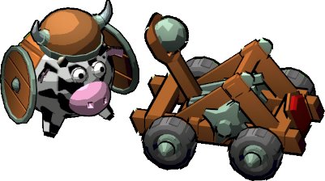
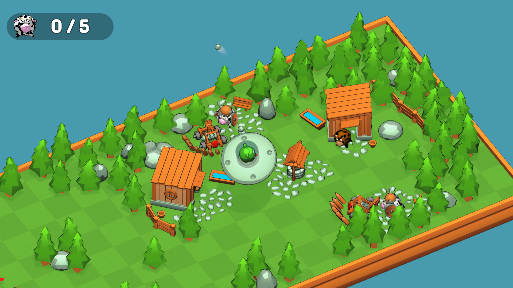

# Cows Crasher

  

This is a simple arcade action game about a confrontation between UFOs and cows, made in a week for a local gamejam. All game logic is written according to the component approach (Unity-way) without any architecture things. [Play in browser](https://scrawach.github.io/cows-crasher-webgl/).

# Control

- WASD - movement;
- Q - anti-gravity beam.

# Screenshots

  
  
  

# Gameplay Video Link

  

